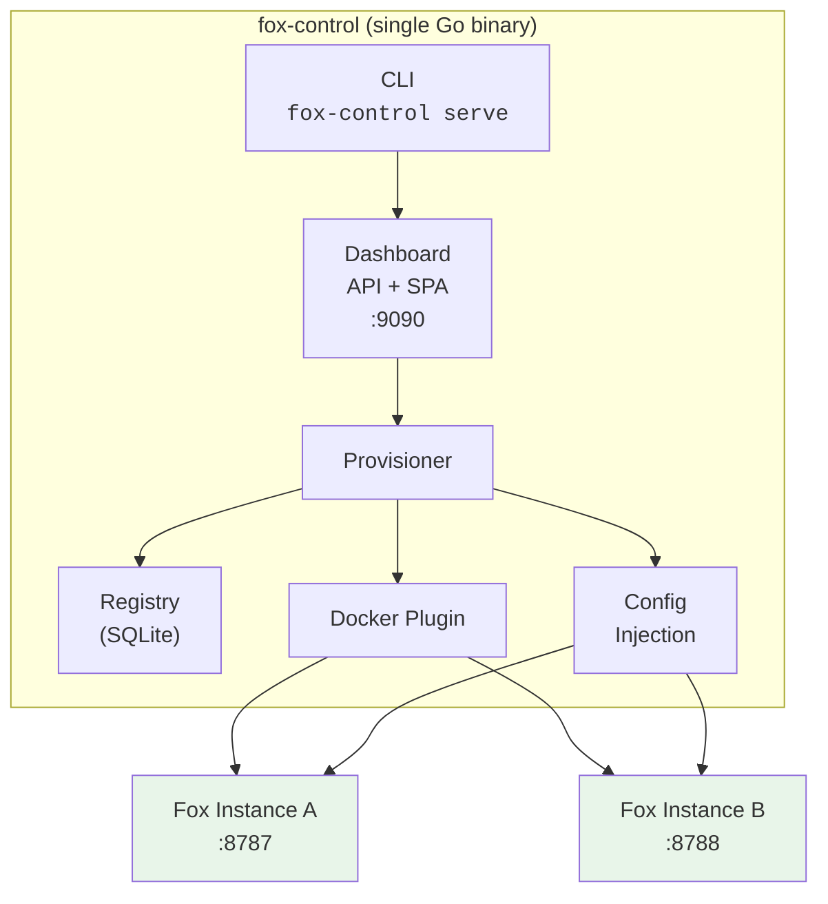

# Fox Fleet

[](https://github.com/fox-in-the-box-ai/fox-fleet/actions/workflows/ci.yml)
[](LICENSE)
[](go.mod)

Open-source management plane for [Fox in the Box](https://github.com/fox-in-the-box-ai/fox-in-the-box) AI assistants. One binary, one config file, one Docker host — provision, monitor, update, and destroy a fleet of Fox instances through a CLI and browser-based panel.

> **Status: v0.1 feature-complete.** All 11 Fleet-repo tickets and 5 Fox-runtime prereqs are implemented and tested. Pending: release tooling and tag. Not production-ready yet.

---

## Why Fox Fleet

Running one Fox assistant is easy. Running five for a team means five containers, five port assignments, five health checks, five image updates — all by hand.

Fox Fleet eliminates that. A single `fox-control` binary manages the full lifecycle:

- **Provision** — allocate a port, inject config and credentials, start a container, health-check until ready.
- **Monitor** — browser panel with per-instance health status, logs, and image metadata.
- **Update** — rolling image rollout with automatic health-gating and one-command rollback.
- **Destroy** — stop the container, optionally remove data, clean up the registry.

Every managed instance is an unmodified Fox container. Fleet wraps instances with management infrastructure — it never modifies them. Remove Fleet, and every instance keeps running on its last-injected config. This is the same wrap-don't-fork discipline Fox uses internally.

---

## Architecture



**Key design decisions:**

- **Plugin interface** — `DeploymentPlugin` is a 7-operation Go interface (Provision, HealthCheck, Configure, Rollout, Rollback, Destroy, Logs). Docker is the built-in implementation. The interface accommodates Kubernetes and Compose plugins without changes.
- **SQLite registry** — instance metadata in a single embedded database. CGO-free via `modernc.org/sqlite`. No external database dependency.
- **Config injection** — each instance gets its own data directory with `config.yaml`, `settings.json`, and `hermes.env` written before container start. Credentials are injected as environment variables, never baked into images.
- **Shared-secret auth** — `admin_secret` authenticates the operator to the panel and is injected into each instance as `FOX_PLANE_AUTH_SECRET`. The instance's `check_auth` gate validates it. `instance_password` enables upstream session auth per the managed-mode invariant.

---

## Status and roadmap

Fox Fleet ships in three milestones.

| Milestone | Theme | Status |
|-----------|-------|--------|
| **v0.1** | Management plane MVP — provision, monitor, update, destroy through CLI and panel | Feature-complete (11/11 Fleet + 5/5 Fox prereqs) |
| **v0.2** | Data plane — organizational knowledge (ingestion, vector search, query API, skillsets) | Planned |
| **v1.0** | Apache GA — conformance CI, cosign + SBOM, all PRODUCTS.md promises shipped | Condition-gated |

v0.2 ships 6-8 weeks after v0.1, condition-gated on at least one operator running v0.1. v1.0 ships when 3 operators have run Fleet with zero critical bugs for 2 consecutive releases.

Full roadmap: [FLEET_BASE_ROADMAP.md](https://github.com/fox-in-the-box-ai/fox-in-the-box/blob/main/docs/architecture/FLEET_BASE_ROADMAP.md)

---

## Quickstart

> Requires Go 1.25+ and Docker.

```bash
# Clone and build
git clone https://github.com/fox-in-the-box-ai/fox-fleet.git
cd fox-fleet
make build

# Configure
cat > fox-control.toml <<EOF
[control]
listen = "127.0.0.1:9090"
data_root = "/var/lib/fox-control"

[docker]
image = "ghcr.io/fox-in-the-box-ai/cloud:stable"

[auth]
admin_secret = "change-me-to-a-real-secret"
instance_password = "change-me-to-a-real-password"

[instances]
max_instances = 2
EOF

# Run
./fox-control serve --config fox-control.toml
```

Provision an instance:

```bash
./fox-control provision --id my-fox --config fox-control.toml
```

List running instances:

```bash
./fox-control list --config fox-control.toml
```

Destroy an instance:

```bash
./fox-control destroy --id my-fox --config fox-control.toml
./fox-control destroy --id my-fox --remove-data --config fox-control.toml
```

---

## Repository layout

```
cmd/fox-control/       CLI entry point, TOML config parsing, cobra subcommands
internal/
  config/              Config injection (writes instance data dirs)
  provisioner/         Provisioning loop orchestrator (mutex, port alloc, rollback)
  registry/            Instance registry (SQLite, CRUD, status tracking)
plugins/
  plugin.go            DeploymentPlugin interface + shared types
  docker/              Docker plugin implementation (7 operations)
panel/
  api/                 Dashboard HTTP API + health poller
  spa/                 Embedded single-page dashboard
conformance/
  runtime/             Runtime conformance test suite (16 checks)
  plugin/              Plugin conformance test suite (8 checks)
rollout/               Fleet rollout orchestration (rolling update + health-gated rollback)
data-plane/            Shared Qdrant, ingestion shim, query API (v0.2)
skillsets/             Skillset manifest spec + Hermes adapter (v0.2)
docs/                  Product-specific documentation
```

---

## The Fox ecosystem

Fox Fleet is the middle layer of a four-repo open-core architecture:

```
fox-in-the-box (MIT)           The assistant runtime
        ▲
        │ contract schemas, HTTP client
        │
fox-fleet (Apache 2.0)         This repo — management plane for fleets
        ▲
        │ Go module import
        │
fox-fleet-enterprise           Enterprise overlay (RBAC, audit, LLM proxy,
(Commercial)                   OIDC edge gateway, K8s plugin)
        ▲
        │
fox-cloud (Commercial)         Hosted product
```

**Dependency direction is one-way.** Fox never imports Fleet. Fleet never imports Enterprise. Removing any layer leaves the layer below fully operational. Removing Fleet leaves every Fox instance running standalone on its last-injected config. This is four-layer removability.

| Product | License | Default cap | What it adds |
|---------|---------|-------------|-------------|
| **Fox in the Box** | MIT | 1 (single-user) | The assistant itself — container image, desktop app, overlay |
| **Fox Fleet** | Apache 2.0 | 2 (configurable) | Provisioning, monitoring, updates, basic data plane |
| **Fox Fleet Enterprise** | Commercial | Unlimited | RBAC, audit logs, LLM proxy, SSO/OIDC, K8s plugin |
| **Fox Cloud** | Commercial | Unlimited | Hosted runtime, billing, multi-tenant |

---

## Architecture invariants

These hold across the entire Fox ecosystem. Fleet inherits all of them.

1. **Wrap, don't fork** — Fleet wraps fleets of Fox instances the same way the Fox overlay wraps Hermes. Additive behavior via HTTP contracts and config injection, never source modification.
2. **Additive and removable** — every Fleet-managed surface can be removed. Instances keep running. The panel disappearing doesn't affect containers. Data plane disappearing doesn't break chat.
3. **Fail loud** — missing secrets, missing config, unreachable dependencies produce explicit errors. `fox-control` refuses to start if `admin_secret` or `instance_password` is empty.
4. **Single-tenant instance** — one isolated assistant per person. Fleet is multi-instance management; instances themselves are single-tenant.
5. **Runtime-agnostic** — HTTP contracts only. Fox (Hermes) is the reference runtime. The `DeploymentPlugin` interface and instance contract support any conformant runtime.

---

## Development

### Prerequisites

- Go 1.25+
- Docker (for integration tests and the Docker plugin)
- [golangci-lint](https://golangci-lint.run/) (for `make lint`)

### Quality gate

```bash
make lint          # golangci-lint run
make test          # go test ./...
make build         # go build with ldflags
make conformance   # runtime + plugin conformance suites
```

All four commands must pass before opening a PR.

### Running tests

```bash
# All tests
make test

# Specific package
go test ./internal/provisioner/...
go test ./internal/registry/...
go test ./cmd/fox-control/...
go test ./plugins/docker/...
```

Tests use temporary directories and in-memory SQLite — no Docker daemon required for unit tests.

---

## Contributing

See [CONTRIBUTING.md](CONTRIBUTING.md).

**Short version:** branch from `main`, one logical change per PR, all checks green, squash-merge. Commit messages in imperative present tense, referencing ticket IDs.

---

## Security

See [SECURITY.md](SECURITY.md) for vulnerability reporting policy.

Fox Fleet's auth model uses shared secrets (not OIDC/mTLS — those are Fleet Enterprise features). For v0.1, the threat model assumes a trusted network. The `admin_secret` authenticates operator-to-panel and panel-to-instance communication via `X-Fox-Auth` headers with constant-time comparison. Credentials are injected at provision time and never logged.

---

## License

[Apache License 2.0](LICENSE)

Copyright 2026 Fox in the Box AI

---

<sub>Fox Fleet is part of the [Fox in the Box](https://github.com/fox-in-the-box-ai) ecosystem.</sub>
