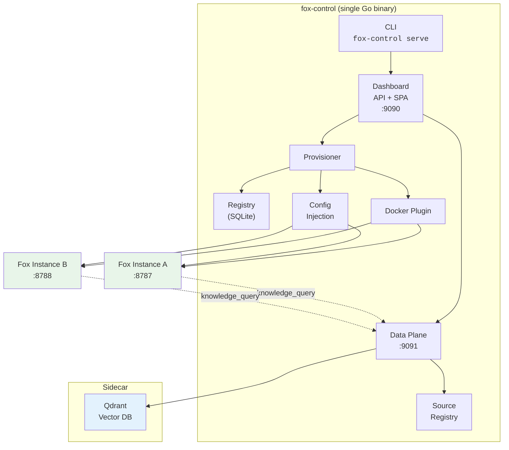

# Fox Fleet

[](https://github.com/fox-in-the-box-ai/fox-fleet/actions/workflows/ci.yml)
[](LICENSE)
[](go.mod)

Open-source management plane for [Fox in the Box](https://github.com/fox-in-the-box-ai/fox-in-the-box) AI assistants. One binary, one config file, one Docker host — provision, monitor, update, and destroy a fleet of Fox instances through a CLI and browser-based panel.

> **Status: v1.4.0 GA.** Production-ready. Signed releases (cosign + SBOM), conformance in CI, full deployment paths (Compose / Helm / systemd / Homebrew / apt / container image).

---

## Why Fox Fleet

Running one Fox assistant is easy. Running five for a team means five containers, five port assignments, five health checks, five image updates — all by hand.

Fox Fleet eliminates that. A single `fox-control` binary manages the full lifecycle:

- **Provision** — allocate a port, inject config and credentials, start a container, health-check until ready.
- **Monitor** — browser panel with per-instance health status, logs, and image metadata.
- **Update** — rolling image rollout with automatic health-gating and one-command rollback.
- **Destroy** — stop the container, optionally remove data, clean up the registry.

Every managed instance is an unmodified Fox container. Fleet wraps instances with management infrastructure — it never modifies them. Remove Fleet, and every instance keeps running on its last-injected config.

---

## Install

Pick your platform. Each guide covers every available install channel and verification steps.

| Platform | Recommended channel | Guide |
|----------|-------------------|-------|
| **Linux** | Install script | [docs/install/linux.md](docs/install/linux.md) |
| **macOS** | Homebrew | [docs/install/macos.md](docs/install/macos.md) |
| **Windows** | Docker Compose | [docs/install/windows.md](docs/install/windows.md) |
| **Kubernetes** | Helm chart | [docs/install/kubernetes.md](docs/install/kubernetes.md) |

### Verify installation

```bash
fox-control version
# fox-control v1.0.0 (commit abc1234, built 2026-06-01)
```

For container deployments:

```bash
curl -s http://localhost:9090/healthz
# {"status":"ok"}
```

Release artifacts are signed with [Sigstore cosign](https://docs.sigstore.dev/cosign/overview/) and include an SBOM. See [docs/security/signing.md](docs/security/signing.md) for verification commands.

---

## Quickstart

End-to-end guides — from zero to a running Fleet with one provisioned Fox assistant, under 15 minutes.

| Platform | Guide |
|----------|-------|
| **Linux** | [docs/quickstart/linux.md](docs/quickstart/linux.md) |
| **macOS** | [docs/quickstart/macos.md](docs/quickstart/macos.md) |
| **Windows** | [docs/quickstart/windows.md](docs/quickstart/windows.md) |
| **Kubernetes** | [docs/quickstart/kubernetes.md](docs/quickstart/kubernetes.md) |

For a detailed step-by-step walkthrough (12 scenes from first launch to fleet management), see [docs/WALKTHROUGH.md](docs/WALKTHROUGH.md).

---

## What end users see

Fox Fleet is the management plane — operators install and run it. End users interact with **Fox**, the AI assistant, through their browser.

Once an operator provisions a Fox instance, end users open it at the instance URL (default `http://localhost:8787`) and follow the onboarding wizard to configure their AI provider. From there, Fox provides a chat interface with memory, multi-profile support, and skills.

Fox is a separate project with its own documentation:

- **Fox in the Box** — [github.com/fox-in-the-box-ai/fox-in-the-box](https://github.com/fox-in-the-box-ai/fox-in-the-box)

Operators: point your team members to the Fox project README for end-user setup and usage guidance.

---

## Operator handbook

For day-2 operations — instance lifecycle, secret rotation, skillset management, knowledge data plane, rolling updates, backup and recovery, monitoring, capacity, and security operations:

[docs/operator/handbook.md](docs/operator/handbook.md)

For deployment method details (Docker Compose, Helm, systemd, binary):

[docs/DEPLOYMENT.md](docs/DEPLOYMENT.md)

For full configuration reference:

[docs/configuration.md](docs/configuration.md)

---

## Architecture



**Key design decisions:**

- **Plugin interface** — `DeploymentPlugin` is a 9-method Go interface (Provision, HealthCheck, Configure, Rollout, Rollback, Destroy, Logs, Restart, Stats). Docker is the built-in implementation. The interface accommodates Kubernetes and Compose plugins without changes.
- **SQLite registry** — instance metadata in a single embedded database. CGO-free via `modernc.org/sqlite`. No external database dependency.
- **Config injection** — each instance gets its own data directory with `config.yaml`, `settings.json`, `hermes.env`, and `tools.json` written before container start. When a data plane is configured, `tools.json` includes a `knowledge_query` tool manifest pointing instances at the query API. Credentials are injected as environment variables, never baked into images.
- **Data plane** — optional organizational knowledge layer. File and REST ingestion connectors chunk documents, embed them via an OpenAI-compatible API, and store vectors in a shared Qdrant sidecar. Instances query the data plane through the `knowledge_query` tool injected by config injection.
- **Shared-secret auth** — `admin_secret` authenticates the operator to the panel and is injected into each instance as `FOX_PLANE_AUTH_SECRET`. The instance's `check_auth` gate validates it. `instance_password` enables upstream session auth per the managed-mode invariant.

### Architecture invariants

These hold across the entire Fox ecosystem. Fleet inherits all of them.

1. **Wrap, don't fork** — Fleet wraps fleets of Fox instances the same way the Fox overlay wraps Hermes. Additive behavior via HTTP contracts and config injection, never source modification.
2. **Additive and removable** — every Fleet-managed surface can be removed. Instances keep running. The panel disappearing doesn't affect containers. Data plane disappearing doesn't break chat.
3. **Fail loud** — missing secrets, missing config, unreachable dependencies produce explicit errors. `fox-control` refuses to start if `admin_secret` or `instance_password` is empty.
4. **Single-tenant instance** — one isolated assistant per person. Fleet is multi-instance management; instances themselves are single-tenant.
5. **Runtime-agnostic** — HTTP contracts only. Fox (Hermes) is the reference runtime. The `DeploymentPlugin` interface and instance contract support any conformant runtime.

### Known limitations

Fox Fleet has intentional architectural boundaries: single-host only (no multi-node), no HA (single SQLite), single admin token (no RBAC), Docker socket is root-equivalent. See [docs/LIMITATIONS.md](docs/LIMITATIONS.md) for the full list.

---

## The Fox ecosystem

Fox Fleet is the middle layer of a four-repo open-core architecture:

```
fox-in-the-box (MIT)           The assistant runtime
        ▲
        │ contract schemas, HTTP client
        │
fox-fleet (Apache 2.0)         This repo — management plane for fleets
        ▲
        │ Go module import
        │
fox-fleet-enterprise           Enterprise overlay (RBAC, audit, LLM proxy,
(Commercial)                   OIDC edge gateway, K8s plugin)
        ▲
        │
fox-cloud (Commercial)         Hosted product
```

**Dependency direction is one-way.** Fox never imports Fleet. Fleet never imports Enterprise. Removing any layer leaves the layer below fully operational.

| Product | License | Default cap | What it adds |
|---------|---------|-------------|-------------|
| **Fox in the Box** | MIT | 1 (single-user) | The assistant itself — container image, desktop app, overlay |
| **Fox Fleet** | Apache 2.0 | 2 (configurable) | Provisioning, monitoring, updates, knowledge data plane, skillsets |
| **Fox Fleet Enterprise** | Commercial | Unlimited | RBAC, audit logs, LLM proxy, SSO/OIDC, K8s plugin |
| **Fox Cloud** | Commercial | Unlimited | Hosted runtime, billing, multi-tenant |

---

## Status and roadmap

| Milestone | Theme | Status |
|-----------|-------|--------|
| **v0.1** | Management plane MVP — provision, monitor, update, destroy through CLI and panel | Shipped (0.1.0-alpha) |
| **v0.2** | Data plane — organizational knowledge (ingestion, vector search, query API, skillsets) | Shipped (0.2.0-alpha) |
| **v0.3** | Product polish — branded UI, i18n, dark mode, mobile, SSE, deployment infra, docs | Shipped (0.3.0-alpha) |
| **v1.0** | Apache GA — conformance CI, cosign + SBOM, full deployment paths, all PRODUCTS.md promises | Shipped (1.0.0) |
| **v1.0.1** | SSE auth hardened (session tokens), data plane query auth | Shipped (1.0.1) |
| **v1.1** | Security hardening — file permissions, SSRF, path traversal, WriteTimeout, env blocklist, security headers, persistent events | Shipped (1.1.0) |
| **v1.2** | Operations — Prometheus metrics, built-in TLS, backup CLI, diagnostics, webhooks, structured logging, rate limiting | Shipped (1.2.0) |
| **v1.3** | Data plane hardening — embedding retry, Qdrant timeouts/batching/health, incremental ingestion, auto-restart, conformance | Shipped (1.3.0) |
| **v1.4** | Panel & docs — health timeline, resource gauges, i18n (en/es/fr), skillset picker, operator/developer handbooks, OpenAPI spec, examples | Shipped (1.4.0) |

Full roadmap: [FLEET_BASE_ROADMAP.md](https://github.com/fox-in-the-box-ai/fox-in-the-box/blob/main/docs/architecture/FLEET_BASE_ROADMAP.md)

---

## Development

### Prerequisites

- Go 1.25+
- Docker (for integration tests and the Docker plugin)
- [golangci-lint](https://golangci-lint.run/) (for `make lint`)

### Quality gate

```bash
make lint          # golangci-lint run
make test          # go test ./...
make build         # go build with ldflags
make conformance   # runtime + plugin conformance suites
```

All four commands must pass before opening a PR.

### Repository layout

```
cmd/fox-control/       CLI entry point, TOML config parsing, cobra subcommands
internal/
  config/              Config injection (writes instance data dirs incl. tools.json)
  provisioner/         Provisioning loop orchestrator (mutex, port alloc, skillset copy, rollback)
  registry/            Instance registry (SQLite, CRUD, status + skillset tracking)
plugins/
  plugin.go            DeploymentPlugin interface + shared types
  docker/              Docker plugin implementation (9 methods)
panel/
  api/                 Dashboard HTTP API + health poller + source listing
  spa/                 Embedded single-page dashboard (instances + sources tabs)
conformance/
  runtime/             Runtime conformance test suite (16 checks)
  plugin/              Plugin conformance test suite (8 checks)
rollout/               Fleet rollout orchestration (rolling update + health-gated rollback)
data-plane/            Data plane server, Qdrant client, ingestion connectors, query API, source registry
skillsets/             Skillset manifest spec, YAML parser + validator
docs/                  Product-specific documentation
```

---

## Security

See [SECURITY.md](SECURITY.md) for vulnerability reporting policy.

Fox Fleet's auth model uses shared secrets (not OIDC/mTLS — those are Fleet Enterprise features). The `admin_secret` authenticates operator-to-panel and panel-to-instance communication via `X-Fox-Auth` headers with constant-time comparison. Credentials are injected at provision time and never logged.

**Release signing:** every release artifact (binaries, checksums, container images) is signed with [Sigstore cosign](https://docs.sigstore.dev/cosign/overview/) via GitHub Actions OIDC — no long-lived keys. Verify with `fox-control verify <tarball>` or cosign directly. See [docs/security/signing.md](docs/security/signing.md).

---

## Contributing

See [CONTRIBUTING.md](CONTRIBUTING.md).

**Short version:** branch from `main`, one logical change per PR, all checks green, squash-merge. Commit messages in imperative present tense, referencing ticket IDs.

---

## License

[Apache License 2.0](LICENSE)

Copyright 2026 Vulpy, Inc.

---

<sub>Fox Fleet is part of the [Fox in the Box](https://github.com/fox-in-the-box-ai) ecosystem.</sub>
