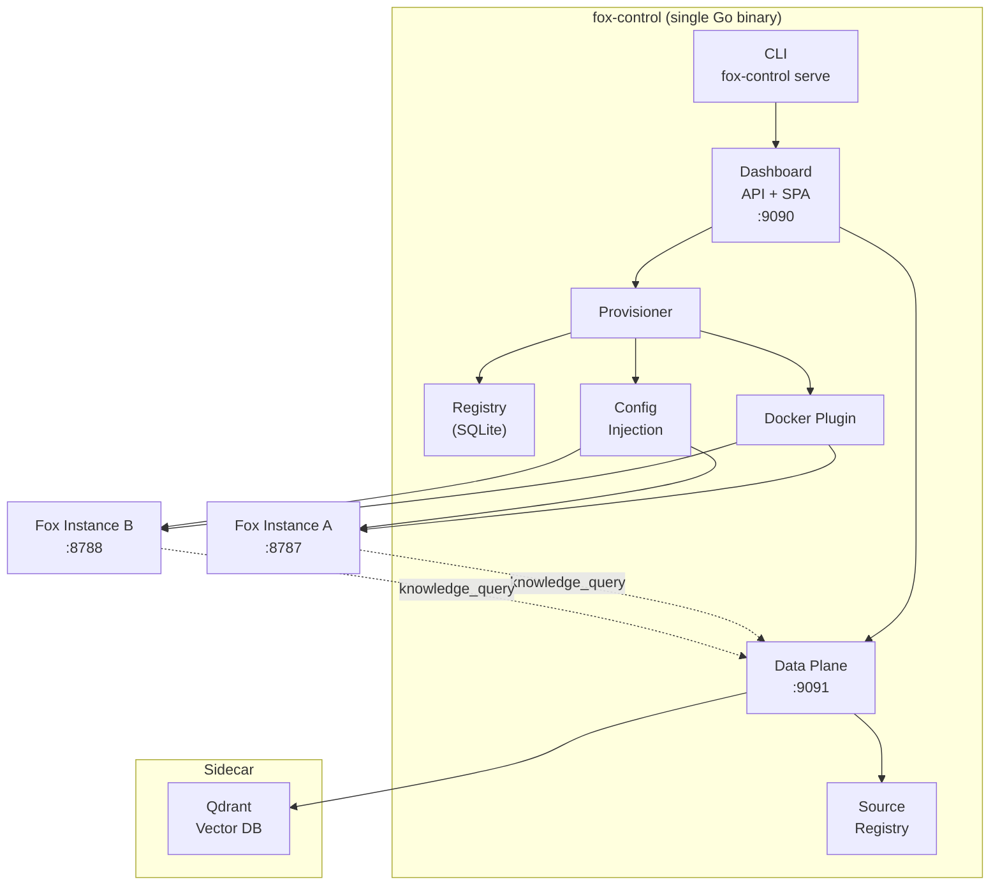

# Fox Fleet

Open-source management plane for [Fox in the Box](https://github.com/fox-in-the-box-ai/fox-in-the-box) AI assistants. One binary, one config file, one Docker host — provision, monitor, update, and destroy a fleet of Fox instances through a CLI and browser-based panel.

---

## Why Fox Fleet

Running one Fox assistant is easy. Running five for a team means five containers, five port assignments, five health checks, five image updates — all by hand.

Fox Fleet eliminates that. A single `fox-control` binary manages the full lifecycle:

- **Provision** — allocate a port, inject config and credentials, start a container, health-check until ready.
- **Monitor** — browser panel with per-instance health status, real-time event feed, and image metadata.
- **Update** — rolling image rollout with automatic health-gating and one-command rollback.
- **Destroy** — stop the container, optionally remove data, clean up the registry.

Every managed instance is an unmodified Fox container. Fleet wraps instances with management infrastructure — it never modifies them. Remove Fleet, and every instance keeps running on its last-injected config.

---

## Architecture

**Key design decisions:**

- **Plugin interface** — `DeploymentPlugin` is a 7-operation Go interface. Docker is the built-in implementation; the interface accommodates Kubernetes and Compose plugins without changes.
- **SQLite registry** — instance metadata in a single embedded database. CGO-free via `modernc.org/sqlite`. No external database dependency.
- **Config injection** — each instance gets its own data directory with `config.yaml`, `settings.json`, `hermes.env`, and `tools.json` written before container start.
- **Data plane** — optional organizational knowledge layer. File and REST ingestion connectors chunk documents, embed them via an OpenAI-compatible API, and store vectors in a shared Qdrant sidecar.
- **Shared-secret auth** — `admin_secret` authenticates the operator to the panel and is injected into each instance. Constant-time comparison throughout.

---

## Quick links

| | |
|---|---|
| [Installation](getting-started.md) | Binary, Homebrew, Debian, Docker, or install script |
| [Walkthrough](WALKTHROUGH.md) | Step-by-step from first launch to teardown |
| [Deployment](DEPLOYMENT.md) | Docker Compose, Helm, systemd, manual |
| [Configuration](configuration.md) | Full config file reference |
| [Release Signing](security/signing.md) | Verify binaries and container images |
| [Changelog](changelog.md) | All notable changes |
